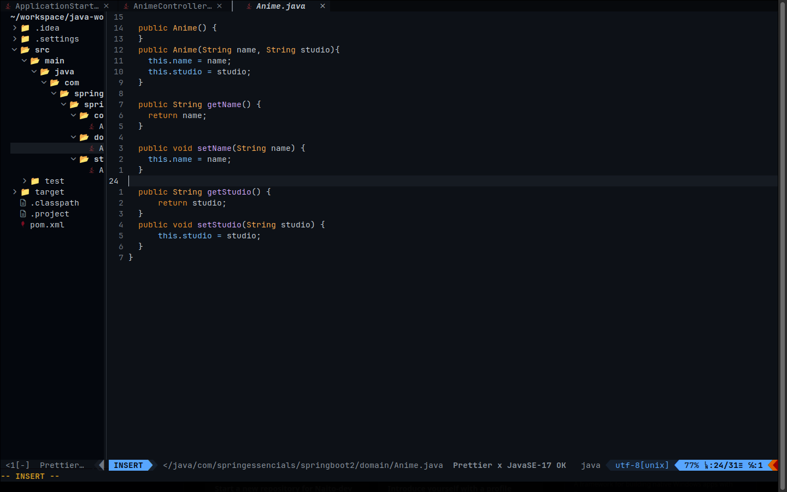

# My Nvim configuration for java Workspace

    I love vim and Neovim, and i send my configuration to world(Vim Maniacs in github hahaha) for help me in upgrades or talking for the grandious text editor is (the god vim) hahaha




## installation

My Operational System in moment is ubuntu, however, is usualy fore more systems 

### DEPENDENCIES:

#### installed in your System:

-snap
-git
-Neovim

#### On Debian based distros, run:

for snap repository:
```bash
sudo apt install snapd
```

for nvim:
```bash
sudo snap install --classic nvim
```

for git:
```bash
sudo apt install git
```

next step for installed dependecies:

### Clone the repository

in your terminal, run:

```bash
git clone https://github.com/Naito-dev/nvim ~/.config/
```
and run nvim:
```bash
nvim```

