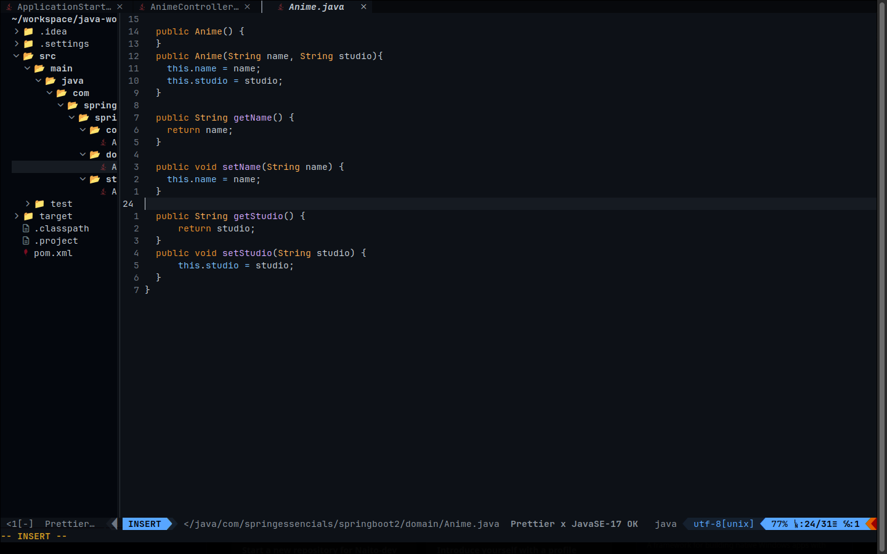

# My Nvim configuration for java Workspace

I love vim and Neovim, and i send my configuration to world(Vim Maniacs in github hahaha) for help me in upgrades or talking for the grandious text editor is (the god vim) hahaha




## installation

My Operational System in moment is ubuntu, however, is usualy fore more systems 

### DEPENDENCIES:

#### installed in your System:

-snap  
-git
-curl
-Neovim  

### this intalation tutorial is for Debian based distros

```bash
#Update the repository
sudo apt update
```

```bash
#for snap repository:
sudo apt install snapd
```

```bash
#for nvim:
sudo snap install --classic nvim
```

```bash
#for git and curl:
sudo apt install git curl
```

next step for installed dependecies:

### Clone the repository

in your terminal, run:


```bash
git clone https://github.com/Naito-dev/nvim ~/.config/
```


```bash
#need install VimPlug for install this plugins in init.vim:
sh -c 'curl -fLo "${XDG_DATA_HOME:-$HOME/.local/share}"/nvim/site/autoload/plug.vim --create-dirs \
"     https://raw.githubusercontent.com/junegunn/vim-plug/master/plug.vim'
```

```bash
#and run nvim:
nvim
```

just Coc plugin for language server run, you need compile he, I won't go into detail about this, i share the official repository for Coc Plugin for you compile and install Lsp:
[Coc official repository](https://github.com/neoclide/coc.nvim)

  


